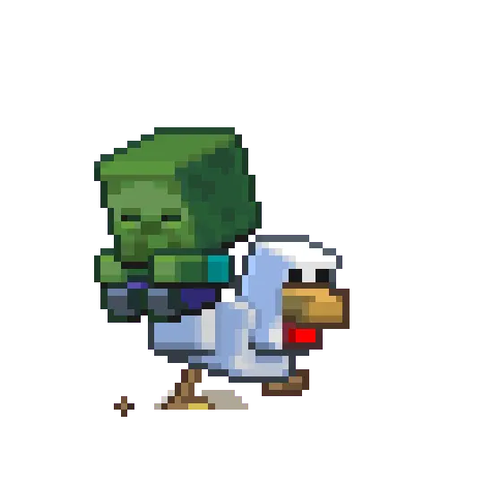

   

  

  
  &nbsp;
  
  &nbsp;
  
  

   

  
    

  

  

    <table border="0">
      <tr>
        <td valign="top">
          
        </td>
        <td valign="top">
          
        </td>
      </tr>
    </table>
  

  
   
  

  

